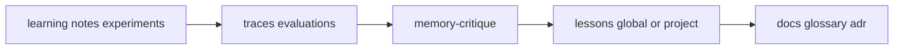

# LEARNING_SANDBOX.md — 学習・実験層

**姉妹文書**: [`MEMORY_ARCHITECTURE.md`](./MEMORY_ARCHITECTURE.md) · [`PM_ROUTING.md`](./PM_ROUTING.md)

## 位置づけ

| 層 | パス | 性質 |
|----|------|------|
| チャット | IDE | 揮発 |
| **Learning** | `learning/` · `.agents/learning/` | **検証前**の調査・実験・教材 |
| Memory | `.agents/memory/` | episode · trace · evaluation |
| Lessons | `memory/.../lessons/` · `global/.../lessons/` | **検証済み**教訓（trace/critique 必須） |
| Team | `docs/` · `plans/` | 正本 |

Learning は **Assumption 扱い**。Loop1 の P/H · gate 判断根拠にしない。

**R-3**: `learning/**` はコードベース索引から除外推奨（`.cursorignore` またはプロジェクト側設定）。

## 配置

| 配置 | いつ |
|------|------|
| `%USERPROFILE%\.agents\learning\<topic>\` | 横断（CUDA、言語、汎用技術） |
| `{workspace}\.agents\learning\<topic>\` | プロジェクト固有 |

キット bootstrap 時: `learning/_template` をコピーしてトピック作成。具体トピック（cuda 等）はユーザーが追加。

## トピック構造

```
learning/<topic>/
├── README.md
├── manifest.yaml      # status · license · promotion_target
├── notes/             # landscape-research 下書き可
├── experiments/       # テスト・デバッグ（本番コードと分離）
└── sources/           # clone · 大容量（gitignore）
```

### manifest.yaml

| フィールド | 意味 |
|------------|------|
| `status` | `exploring` → `validating` → `promoted` \| `archived` |
| `scope` | `cross-project` \| `project` |
| `promotion_target` | 昇格先の意図（実行は memory-record 経由） |
| `constraints.no_write` | 学習中に触らないパス |

## 許可される作業

- **`landscape-research`** · Web 調査 → `notes/`
- **`experiments/`** へのテストコード・スパイク・デバッグ
- **`sources/`** への clone / SDK 展開（manifest に license 記録）
- トピック専用 `.venv`（CUDA 等）— **キット `env/` やプロジェクト venv と混ぜない**

## 禁止

| 禁止 | 理由 |
|------|------|
| `learning/` から **直接** `docs/` · `plans/` を正本更新 | team 層汚染 |
| critique/trace 無しで **lesson 昇格** | confabulation（`AGENT_EVALUATION.md`） |
| 学習中に **`skills/` · `rules/` · キット正本** を変更 | kit_maintainer 以外 |
| `notes/` を **Fact** として PM ルーティングに使用 | Assumption のまま |
| 秘密情報を `notes/` に平文 | セキュリティ |

## PM ルーティング（学習ターン）

ユーザーが `learning/<topic>` を明示したとき:

1. **context-guard** → **memory-reference**（nav に `session_intent: learning:<topic>` 推奨）
2. **Loop2 skip** 可（P/H 再分類不要）— ただし gate=block 中は学習も record 禁止
3. 主 Skill: **`landscape-research`**（調査）· builder 相当の実験は **`learning/<topic>/experiments/` のみ**
4. 終端: **action-evaluate**（mini 可）→ **memory-flush** → 昇格候補は **lessons へコピー提案**（自動正本化しない）
5. **`docs/project-state.yaml` は更新しない**（学習モード）

Rule: [`rules/learning-sandbox.mdc`](../rules/learning-sandbox.mdc)

## 昇格パイプライン



| 段階 | 条件 |
|------|------|
| notes → lesson 候補 | trace + landscape report または verifiable_checks |
| lesson → docs | `memory-reason` promotion graph · `doc-record` |

`manifest.status: promoted` は lesson/docs 反映**後**に手動更新。

## Git

| パス | 推奨 |
|------|------|
| `learning/README.md` · `_template/` | commit 可 |
| `learning/<topic>/notes/` · `experiments/` | 小さければ commit 可 |
| `learning/**/sources/` | **gitignore** |
| `learning/**/.venv/` · `node_modules/` | **gitignore** |

## 索引（任意）

`learning/index.yaml` — アクティブトピック一覧（[`index.yaml.example`](../learning/index.yaml.example)）

## 関連 Skill

| Skill | 用途 |
|-------|------|
| `landscape-research` | 広→狭調査 · notes へ |
| `terminology-research` | 用語（昇格前 alignment は project memory） |
| `memory-flush` / `memory-record` | 検証後の lesson 化 |
| `memory-critique` | 昇格前 grounding |

新規 `learning-conduct` skill は **不要**（初期は本 doc + rule で足りる）。
