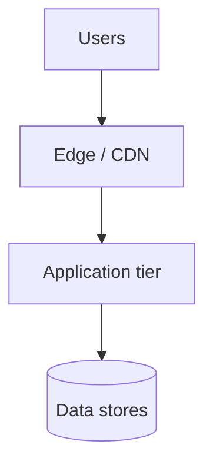

# Cloud topology

**システム**: {{SYSTEM_NAME}}  
**記録日**: {{DATE}}  
**scope_level**: H2 · systems

## 目的

（このインフラが支えるビジネス/アプリ能力を 1 段落）

## コンテキスト図

## 主要コンポーネント

| コンポーネント | 技術 | 責務 |
|----------------|------|------|
| | | |

## データフロー

| 経路 | プロトコル | 暗号化 |
|------|------------|--------|
| | | |

## 関連要件

- `docs/requirements/{{slug}}/要件.md` — NFR（可用性 · 性能 · 復旧）

## Open questions

- 
